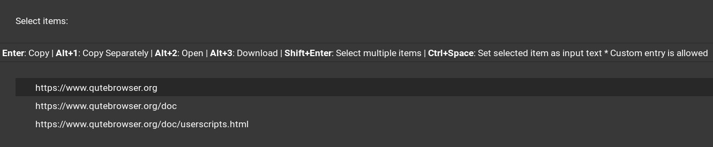

# CIAvash::Qutebrowser::Userscripts

A collection of [userscripts](https://www.qutebrowser.org/doc/userscripts.html) I wrote, and use in [qutebrowser](https://www.qutebrowser.org).



## Requirements

### Clipboard

- Wayland: [wl-clipboard](https://github.com/bugaevc/wl-clipboard)
- X: [xclip](https://github.com/astrand/xclip)

### Selection/Completion

[Rofi](https://github.com/davatorium/rofi/): used in `select*` userscripts

### File Selection

[Zenity](https://wiki.gnome.org/Projects/Zenity): only used in `open-file` userscript

### Programming Language

[Raku](https://www.raku-lang.ir/en/) - Right now regex is the slowest part of Raku, so the scripts doing any parsing will be slow

#### Module Manager

[zef](https://github.com/ugexe/zef)

#### Modules

```console
zef install --deps-only --/test .
```

## Features

### Example configs to show the features

#### Open

```python
# Open file with zenity
config.bind(',of', 'spawn --userscript open-file')
```

#### Hint: Follow

```python
config.bind(',fd', 'hint links userscript open-domain')
```

#### Copy

```python
# Copy title and URL of the page separated with newline
config.bind(',ytu', 'spawn --userscript yank title-url')
# Copy selected text and URL of the page separated with newline
config.bind(',ysu', 'spawn --userscript yank-text-url')
```

##### Copy: Hint

```python
# Copy image URL
config.bind(',yiu', 'hint images userscript yank-url')
# Copy link text
config.bind(',ylt', 'hint links userscript yank-link-text')
config.bind(',rylt', 'hint --rapid links userscript yank-link-text')
# Copy link URL (pretty)
config.bind(',ylu', 'hint links userscript yank-url')
config.bind(',rylu', 'hint --rapid links userscript yank-url')
# Copy link's text and URL separated with newline
config.bind(',yla', 'hint links userscript yank-text-url')
```

#### Select with Rofi

Available actions:

- **Enter**: Copy
- **Alt+1**: Copy Separately (useful if you use a clipboard manager)
- **Alt+2**: Open
- **Alt+3**: Download
- **Shift+Enter**: Select multiple items
- **Ctrl+Space**: Set selected item as input text 
- Custom entry is allowed

```python
config.bind(',sfu', 'spawn --userscript select Feeds')
config.bind(',sft', 'spawn --userscript select Feeds --with-title')
config.bind(',slu', 'spawn --userscript select Links')
config.bind(',slt', 'spawn --userscript select Links --with-title')
config.bind(',siu', 'spawn --userscript select Images')
config.bind(',sit', 'spawn --userscript select Images --with-title')
config.bind(',smu', 'spawn --userscript select MetaLinks')
config.bind(',smt', 'spawn --userscript select MetaLinks --with-title')
config.bind('<Alt-s>', 'spawn --userscript select', mode='command')
config.bind(',sa', 'spawn --userscript select-scroll-to-anchor')
```

##### Select: Hint

```python
non_containers = ['a', 'button', 'img', 'svg', 'input', 'textarea', 'code', 'pre',
                  ''.join([f'h{n}' for n in range(1, 6)])]
c.hints.selectors['containers'] = [
    'body ' + ''.join([':not('+e+')' for e in non_containers])]

config.bind(',seu', 'hint containers userscript select-links')
config.bind(',set', 'hint containers userscript select-links-with-title')
```

##### Select: Dig (Get the URLs of all the segments a URL has)

```python
config.bind(',sdd', 'spawn --userscript dig --domain')
config.bind(',sdu', 'spawn --userscript dig')
```

##### Select: Hint: Dig

```python
config.bind(',sdlu', 'hint links userscript dig')
config.bind(',sdld', 'hint links userscript dig-domain')
```
